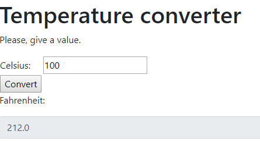

# Unitool

Simple convertion tool made with Spring Boot

## Table of Contents
* [General info](#general-info)
* [Technologies](#technologies)
* [Setup](#setup)

## General info
This project is a simple convertion tool created with Spring Boot as first result learning Spring framework. No further development 
is planned at the moment. It was just a simple excersise.

Below example showing how temperature converter works:

## Technologies
* Spring Boot version 2.1.4.RELEASE
* Bootstrap version 4.3.1

## Setup
Unzip project in In IntelliJ IDEA's default directory (IdeaProjects). Open it with IDE and then hit 'Run'.
